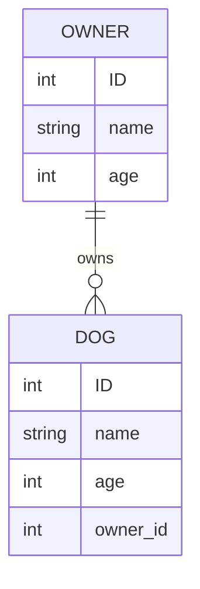

_This markdown will show many examples of documentation for a backend project and provide snippets of the markdown for each section_

# Backend Project

- **Creators:** Alex Merced, Other Person
- **Description:** A JSON API for getting data on dogs and owners
- **technologies used**: ExpressJS, Javascript

```markdown
# Backend Project

- **Creators:** Alex Merced, Other Person
- **Description:** A JSON API for getting data on dogs and owners
- **technologies used**: ExpressJS, Javascript
```

## Models

_this section would provide ERD diagrams of the models in your application, could be an image or on github you can use "mermaid" syntax to generate diagrams in your markdown here is the link for the syntax [mermaid erd diagrams](https://mermaid.js.org/syntax/entityRelationshipDiagram.html)_



```markdown
\```mermaid
erDiagram
    OWNER ||--o{ DOG : owns
    OWNER{
    int ID
    string name
    int age}
    DOG {
    int ID
    string name
    int age
    int owner_id
    }
    \```
```
