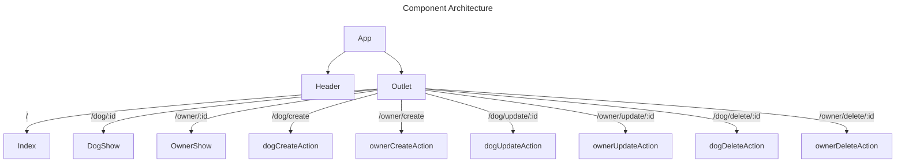

_Below are example sections you'd include in the documentation of a frontend project with snippets of the markdown for each section for reference_

# Frontend Project

- **Creators:** Alex Merced, Other Person
- **Description:** Frontend application allow the CRUD on Owners and Users
- **technologies used**: React, react-router-dom, sass

## Component Architecture

_a design of your component tree assuming your using a frontend framework like react, angular, svelte, solid or vue. This can be done as an image in other software but you can also use mermain diagrams_

