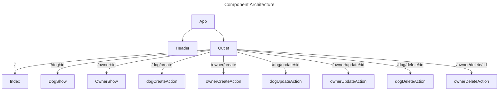

_Below are example sections you'd include in the documentation of a frontend project with snippets of the markdown for each section for reference_

# Frontend Project

- **Creators:** Alex Merced, Other Person
- **Description:** Frontend application allow the CRUD on Owners and Users
- **technologies used**: React, react-router-dom, sass

## Component Architecture

_a design of your component tree assuming your using a frontend framework like react, angular, svelte, solid or vue. This can be done as an image in other software but you can also use mermain diagrams_



```markdown
|```mermaid
---
title: Component Architecture
---
flowchart TD
    App --> Header
    App --> Outlet
    Outlet -- "/" --> Index
    Outlet -- "/dog/:id" --> DogShow
    Outlet -- "/owner/:id" --> OwnerShow
    Outlet -- "/dog/create" --> dogCreateAction
    Outlet -- "/owner/create" --> ownerCreateAction
    Outlet -- "/dog/update/:id" --> dogUpdateAction
    Outlet -- "/owner/update/:id" --> ownerUpdateAction
    Outlet -- "/dog/delete/:id" --> dogDeleteAction
    Outlet -- "/owner/delete/:id" --> ownerDeleteAction

|```
```
_ignore the pipes before the backticks, they are there to just avoid the backtickets from terminating the codeblock early_

## Route Table

_If using a frontend router like react-router-dom then create a routing table for your frontend application, if using the react-router-dom data routers then also specify any loaders and actions used in routes_

| Route | Element | Loader | Action | Summary |
|-------|---------|--------|--------|---------|
| / | Index | indexLoader | | Loads up list of dogs and owners |
| /dog/:id | DogShow | dogShowLoader | | Loads up an individual dog |
| /owner/:id | OwnerShow | ownerShowLoader | | Loads up an individual owner |
| /dog/create | | | dogCreateAction | handles submission of create form for dogs |
| /owner/create | | | ownerCreateAction | handles submission of create form for owners |
| /dog/update/:id | | | dogUpdateAction | handles submission of update form for dogs |
| /owner/update/:id | | | ownerUpdateAction | handles submission of update form for owners |
| /dog/delete/:id | | | dogDeleteAction | handles submission of delete form for dogs |
| /owner/delete/:id | | | ownerDeleteAction | handles submission of delete form for owners |

```markdown
| Route | Element | Loader | Action | Summary |
|-------|---------|--------|--------|---------|
| / | Index | indexLoader | | Loads up list of dogs and owners |
| /dog/:id | DogShow | dogShowLoader | | Loads up an individual dog |
| /owner/:id | OwnerShow | ownerShowLoader | | Loads up an individual owner |
| /dog/create | | | dogCreateAction | handles submission of create form for dogs |
| /owner/create | | | ownerCreateAction | handles submission of create form for owners |
| /dog/update/:id | | | dogUpdateAction | handles submission of update form for dogs |
| /owner/update/:id | | | ownerUpdateAction | handles submission of update form for owners |
| /dog/delete/:id | | | dogDeleteAction | handles submission of delete form for dogs |
| /owner/delete/:id | | | ownerDeleteAction | handles submission of delete form for owners |
```

## Mockups
_images showing a mockup of your desktop and mobile design these could be made with figma, mockflow or even just drawn on a piece of paper and post the photo_

### Desktop Mockup


### Mobile Mockup


```
### Desktop Mockup


### Mobile Mockup


```
